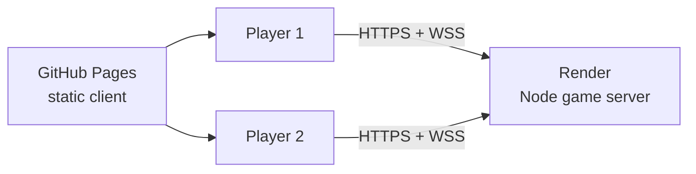

# Deployment: GitHub Pages + Render

Extreme Checkers uses a **split deployment**:

| Component | Host | URL |
|-----------|------|-----|
| Static React client | GitHub Pages | https://jmat50.github.io/extreme-checkers/ |
| Game server (boardgame.io + Socket.IO + lobby API) | [Render](https://render.com) free web service | `https://<your-service>.onrender.com` |

GitHub Pages cannot run Node.js or WebSockets. The Render service handles online multiplayer; the Pages build points at it via `VITE_GAME_SERVER_URL`.

---

## 1. Deploy the game server on Render (one-time)

### Option A — Blueprint (`render.yaml`)

1. Sign in at [render.com](https://render.com) and connect your GitHub account.
2. Use **[Deploy to Render](https://render.com/deploy?repo=https://github.com/Jmat50/extreme-checkers)** or click **New → Blueprint** and select the `Jmat50/extreme-checkers` repository.
3. Render reads [`render.yaml`](../render.yaml) and creates a free web service named `extreme-checkers-api`.
4. After deploy, copy the service URL (e.g. `https://extreme-checkers-api.onrender.com`).
5. Verify: open `https://<your-service>.onrender.com/api/health` — should return `{"ok":true}`.

### Option B — Manual web service

1. **New → Web Service** → connect this repo.
2. Settings:
   - **Name:** `extreme-checkers-api`
   - **Runtime:** Node
   - **Build command:** `npm ci`
   - **Start command:** `npm run start:server`
   - **Plan:** Free
3. Environment variables:

   | Key | Value |
   |-----|-------|
   | `NODE_ENV` | `production` |
   | `ALLOWED_ORIGINS` | `https://jmat50.github.io` |
   | `STORAGE_DIR` | `/tmp/extreme-checkers-storage` |

4. **Health check path:** `/api/health`

### Render free tier notes

- Services **spin down after 15 minutes** without HTTP or WebSocket traffic (~1 minute to wake).
- Filesystem is **ephemeral** — match storage and in-memory lobbies reset on redeploy/restart.
- Fine for demos and casual play; not for production scale.

---

## 2. Wire GitHub Pages to Render

1. In GitHub: **Settings → Secrets and variables → Actions → Variables**.
2. Add repository variable:
   - **Name:** `GAME_SERVER_URL`
   - **Value:** your Render URL with **no trailing slash** (e.g. `https://extreme-checkers-api.onrender.com`)
3. Push to `main` or re-run the **Deploy to GitHub Pages** workflow.

The workflow passes `GAME_SERVER_URL` into the Vite build as `VITE_GAME_SERVER_URL`. The client uses it for:

- Lobby REST calls (`/api/lobbies`)
- boardgame.io `SocketIO` multiplayer sync

---

## 3. Local development

No Render URL needed for local work — Vite proxies API and Socket.IO to port 8000:

```bash
npm run dev:all
```

- Client: http://localhost:5173
- Server: http://localhost:8000

To test a production-style build against Render locally:

```bash
cp .env.example .env.local
# Set VITE_GAME_SERVER_URL=https://your-service.onrender.com
npm run build && npm run preview
```

---

## 4. CORS and origins

[`server/index.ts`](../server/index.ts) allows:

- `http://localhost:*` in development
- `https://jmat50.github.io` (GitHub Pages)
- `RENDER_EXTERNAL_URL` (set automatically on Render)
- Extra origins from `ALLOWED_ORIGINS` (comma-separated)

boardgame.io applies CORS for both the lobby API and Socket.IO when origins match.

---

## 5. Troubleshooting

| Symptom | Fix |
|---------|-----|
| Render deploy fails immediately on start | Check logs for `import.meta.env` errors. Shared game code must use `import.meta.env?.VAR` so Node/tsx can load it. Redeploy latest `main`. |
| Online buttons disabled on Pages | Set `GAME_SERVER_URL` repo variable and redeploy Pages |
| `Failed to create lobby` / CORS error | Confirm `ALLOWED_ORIGINS` includes `https://jmat50.github.io` on Render |
| Long wait before first online game | Render free tier cold start — wait ~1 minute |
| Game disconnects mid-match | Render may restart free instances; refresh and rejoin |
| `/api/health` 404 | Server not deployed or wrong start command (`npm run start:server`) |

---

## Architecture


